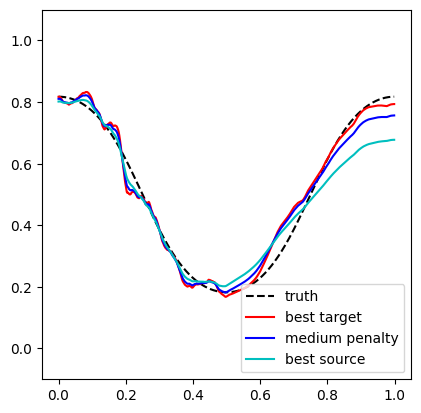

# KRGLM: Pseudo-Labeling for Unsupervised Domain Adaptation with Kernel GLMs

This repository contains the numerical experiments and generic solvers for our paper, *"Pseudo-Labeling for Unsupervised Domain Adaptation with Kernel GLMs."* Our goal is to minimize prediction error in the target domain by leveraging labeled source data and unlabeled target data, despite differences in covariate distributions. We partition the labeled source data into two batches: one for training a family of candidate models, and the other for building an imputation model. This imputation model generates pseudo-labels for the target data, enabling robust model selection.

## 💡 An Illustrative Example: Necessity of Adapting to Covariate Shift and Proposed Solution

To demonstrate the challenge of covariate shift and how our pseudo-labeling method overcomes it, we provide a toy numerical simulation (reproducible via `demo_covariate_shift.ipynb`). 

**The Setup:**
* **Feature space:** $[0,1]$.
* **Sample sizes:** $n = 4000$ labeled source samples and $n_0 = n$ unlabeled target samples.
* **Response model:** Kernel logistic regression, where $y \mid x \sim \text{Bernoulli}(\sigma(f^\ast(x)))$ with the true latent function $f^\ast(x) = 1.5\cos(2\pi x)$, and $\sigma$ the sigmoid function.
* **Source covariate distribution ($\mathcal{P}$):** Concentrated on the left, $\frac{B}{B+1}\mathcal{U}[0, 1/2] + \frac{1}{B+1}\mathcal{U}[1/2, 1]$ with $B=n^{0.45}$.
* **Target covariate distribution ($\mathcal{Q}$):** Concentrated on the right, $\frac{1}{B+1}\mathcal{U}[0, 1/2] + \frac{B}{B+1}\mathcal{U}[1/2, 1]$ with $B=n^{0.45}$.
* **Kernel:** First-order Sobolev kernel, $K(z,w) = \min(z,w)$.

We split the labeled source data in half. On the first half, we run kernel logistic regression with a grid of different ridge penalty parameters ($\lambda$) to obtain a collection of candidate models. 

First, we note the necessity of adapting to covariate shift. On the left panel below, we plotted three candidate models with different penalties. We see that the optimal choice is different for the source and target distributions. On the interval $[0, 1/2]$ where source data is abundant, a large penalty (cyan) provides a great fit. However, on the interval $[1/2, 1]$ where source data is sparse but target data is heavily concentrated, this large penalty oversmooths, and a smaller penalty (red) actually performs better for the target domain.

Then on the right panel below, we compare three model selections methods based on different validation datasets:
* **Naive method (blue)**: validating on the held-out source data, it selects a suboptimal model that fails to adapt to the target distribution.
* **Oracle method (cyan)**: uses true, noiseless target responses.
* **Proposed method (red)**: using only the unlabeled target data with our generated soft pseudo-labels, it successfully selects an adaptive model, achieving performance highly comparable to the oracle.

<p align="center">
  
  
</p>

*Figure 1: Covariate shift and its adaptation in Kernel Logistic Regression. The black dashed curves show the true latent function* $f^\ast(x)$ *.*

*(Note: We also visualize the imputation model used to generate the pseudo-labels, shown in pink. While unsuitable for direct prediction, it is effective for model selection with pseudo-labels).*

For full reproducible details—including the exact grid of hyperparameters and the specific $\lambda$ penalties selected by each method—please refer directly to the `demo_covariate_shift.ipynb` notebook. The final quantitative performance of the selected models is summarized below:

| Method | Target Excess Risk | 95% condidence interval |
| :--- | :--- | :--- |
| **Naive** | 0.016300 | [0.014926, 0.017674] |
| **Pseudo-labeling (Ours)** | 0.003481 | [0.001954, 0.005008] |
| **Oracle** | 0.002855 | [0.001312, 0.004399] |


## 🧮 Algorithmic Details
We implemented a generic solver for kernel GLMs in Python, using the Fisher scoring method. For full mathematical details and notes on our scalable GPU implementation with KeOps, please see our [Algorithmic Details document](ALGORITHM.md).

## 🛠️ Solvers
This repository provides a general solver for kernel ridge regression, kernel logistic regression, and kernel Poisson regression. Standard kernels are available (e.g., linear, polynomial, RBF, first-order Sobolev).

* `rkhs_glm_scaled.py`: Provides the basic solver for ridge-regularized kernel GLMs. For relatively small sample sizes ($n \le 5000$), a simple version using only Numpy and Scipy is enough. 
* `rkhs_glm_scaled_KeOps.py`: For larger problems, we implement the IRLS inner linear solves using kernel matvec oracles computed on-the-fly on the GPU, using the KeOps library. 

## 📊 Experiments

### Synthetic Data (Section 6.1)
We test our approach using logistic regression with the first-order Sobolev kernel. 
* **Run the experiment:** Use `run_experiments_logistic.ipynb`. This notebook calls `pseudo_label_experiment_general.py` (or `pseudo_label_experiment_general_KeOps.py` for the KeOps version).
* **Results:** Because the full experiment is computationally intensive, we have provided the final results in:
    * `results_logistic_torchcpu_1_5_cos_0_4_shift.zip` (covariate shift strength $B=n^{0.4}$) 
    * `results_logistic_torchcpu_1_5_cos_0_45_shift.zip` (covariate shift strength $B=n^{0.45}$) 
* **Plotting:** The results can be plotted using `plot_curves_synthetic.ipynb`, which outputs `logistic_errors_04.pdf` and `logistic_errors_045.pdf`.

### Real-World Data (Section 6.2)
We evaluate our method on the Raisin dataset. 
* **Run the experiment:** The notebook `final_exp_raisin.ipynb` contains everything needed to reproduce the results presented in the paper.

## 📝 Citation
If you use this code in your research, please cite our paper:
```bibtex
@misc{weill2026pseudolabelingunsuperviseddomainadaptation,
      title={Pseudo-Labeling for Unsupervised Domain Adaptation with Kernel GLMs}, 
      author={Nathan Weill and Kaizheng Wang},
      year={2026},
      eprint={2603.19422},
      archivePrefix={arXiv},
      primaryClass={stat.ML},
      url={https://arxiv.org/abs/2603.19422}, 
}

